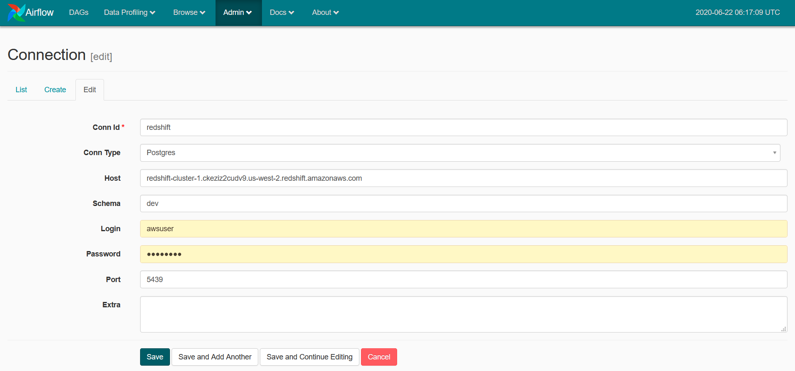

# Data Pipeline with Airflow
### Introduction 
A music streaming company, Sparkify, has decided that it is time to introduce more automation and monitoring to their data warehouse ETL pipelines and come to the conclusion that the best tool to achieve this is Apache Airflow.

They have decided to bring you into the project and expect you to create high grade data pipelines that are dynamic and built from reusable tasks, can be monitored, and allow easy backfills. They have also noted that the data quality plays a big part when analyses are executed on top the data warehouse and want to run tests against their datasets after the ETL steps have been executed to catch any discrepancies in the datasets.

The source data resides in S3 and needs to be processed in Sparkify's data warehouse in Amazon Redshift. The source datasets consist of JSON logs that tell about user activity in the application and JSON metadata about the songs the users listen to.

### How to run this project 

1. Run the following command to run the docker container:
```
$ docker-compose up --build
```
2. Create a redshift cluster and add aws crendential and redshift connection details in airflow:



3. Trigger the DAG and run tasks

### File structure
```
.
├── README.md                               # Introduction of the project
├── docker                                  # Services included in the docker
│   └── airflow                             # Build and configurations file for airflow
│       ├── Dockerfile
│       ├── requirements-python3.5.txt
│       └── start-airflow.sh
├── docker-compose.yml                      # docker-compose file to start containers 
├── img                                     # Images used in README.md
│   ├── example-dag.png
│   └── redshift-connect.png
└── mnt                                     # Folder shared between docker container and local computer
    └── airflow                             # Folder following the directory structure of Airflow
        ├── airflow.cfg
        ├── code
        ├── dags                            # Folder including DAGs
        │   ├── __pycache__
        │   ├── create_tables.sql           # SQL queries referenced in the DAG to create tables
        │   └── udac_example_dag.py         # The DAG definition
        └── plugins                         # Folder including plugins
            ├── __init__.py
            ├── __pycache__
            ├── helpers
            │   ├── __init__.py
            │   ├── __pycache__
            │   └── sql_queries.py          # SQL queries reference in the DAG to insert data 
            └── operators
                ├── __init__.py
                ├── __pycache__
                ├── data_quality.py         # Operator checking data quality of each table
                ├── load_dimension.py       # Operator loading data to dimension tables
                ├── load_fact.py            # Operator loading data to fact table
                └── stage_redshift.py       # Operator loading data from S3 to staging tables in Redshift
```
### Project Datasets
- Log data: s3://udacity-dend/log_data

- Song data: s3://udacity-dend/song_data

### The DAG definition
Flow chart of the DAG:


### Operators
Operators are defined to represent repeated actions like - load data to several stage tables, load data to several fact and dimension tables, and run data quality checks on each table. 

#### Stage Operator
The stage operator loads any JSON formatted files from S3 to Amazon Redshift. The operator creates and runs a SQL COPY statement based on the parameters provided. The operator's parameters specifies where in S3 the file is loaded and what is the target table. 

#### Fact and Dimension Operators 
Most of the logic is within the SQL transformations and the operator takes as input a SQL statement and target database on which to run the query against. Dimension loads are often done with the truncate-insert pattern where the target table is emptied before the load. Fact tables are usually so massive that they should only allow append type functionality.

#### Data Quality Operator
The operator's main functionality is to receive one or more SQL based test cases along with the expected results and execute the tests. For each the test, the test result and expected result needs to be checked and if there is no match, the operator should raise an exception and the task should retry and fail eventually.
